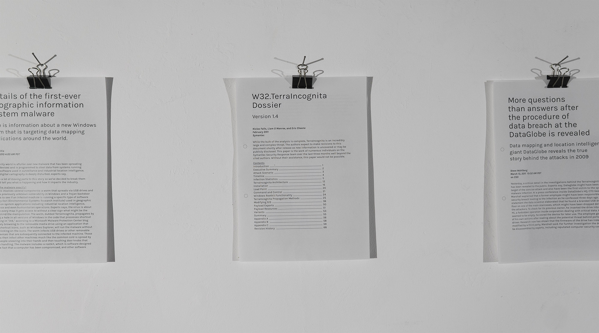

# Documentation of TerraIncognita Dossier

## Information

* Title: TerraIncognita Dossier
* Category: Semester Project
* Student: Alexander Lehmann
* Course Title: Digital Artifactual Objections
* Lecturer: Prof. Dennis P. Paul
* Year: SS 2017

## Text + Images + Videos

*The TerraIncognita Dossier* is a fictional narrative about cyberattacks on mapping services, in which a virus tries to alter the digital representation of the surface of the earth for the benefit of few. The project challenges our perception of space, trustworthiness of digital data and the general intention of maps. A textual timeline of events unravels the incidents of the *W32.TerraIncognita* virus into a thrilling cyber security story.

Maps let us look further than we are able to see with our physical eyes. They are an artificial augmentation to our innate sense of spatial orientation. But this relation is flawed: Usually unrecognizable, it has the potential to undermine our sane sense of spatial reality. Often mistaken as a truthful representation of the world as such, we overlook a heavy discrepancy between the ever-changing surface of our planet and a static collection of digital data of mapping services, that is manipulated through institutions of power and self-interest. It's a false assumption to think about maps as charitable devices that have been created to help us - they aren't scientific measurements. Maps draw borders, obfuscate political inconveniences, offer routings for exploitation, persuade us into false believe. Maps *are* power.

*The TerraIncognita Dossier*, as exhibited at *FAQ* in 2017, consists of a video loop and a narrational timeline of events concerning the incidents in the form of five texts. The longest of the text is the *dossier* itself, describing the fictional attack on one of the largest digital mapping services and its technical prerequisites. Investigators suspect geopolitical interests behind the hacks without being able to pinpoint the responsibility to an institution. The video shows an attempt of a cybersecurity company to prove a correlation between the occurrence of mineral deposits and virus activity through machine learning, suggesting a cover-up of environmental exploitation. The virus itself tries to spread among services, so that no mapping provider remains unaffected. Hence there can't be a guarantee that any digital map at all hasn't undergone a process of manipulation, which makes it even harder to find traces of the infection. Other articles raise questions about practical and civil implications, asking what the essence of digital maps really is.

The development of the project relies strongly on procedural generation, which enabled the possibility to randomly create pictures of pristine landscapes and rough terrains, that are manipulated visibly by the virus. The generator was written in Processing from scratch and is able to create an infinite amount of random sceneries. The narration pays tribute to the non-fictional Stuxnet incidents, ensuring the narration an uncanny possibility of coming true - either through fulfilled technical requirements for an infectious attack on data centers or through large-scale institutional intention to reach an unethical goal with the help of hacking.

